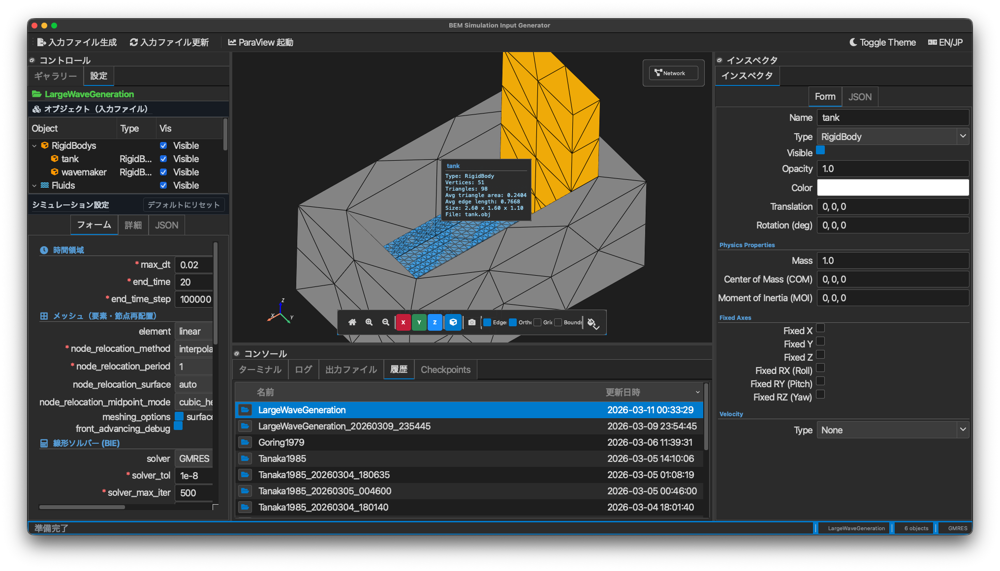

[日本語](ja/)

# BEM for Nonlinear Waves

A boundary element method (BEM) solver for nonlinear free-surface wave problems.

## Overview

This software solves potential flow problems with nonlinear free-surface boundary conditions using the boundary element method. It implements the Mixed Eulerian-Lagrangian (MEL) approach for time-domain simulations and supports frequency-domain analysis.

### Key Capabilities

- **Nonlinear wave generation** -- piston/flap wavemakers, solitary waves, irregular waves
- **Wave-body interaction** -- floating bodies with 6-DOF rigid body dynamics
- **Fast Multipole Method** -- O(N) evaluation of boundary integrals
- **ALE mesh management** -- adaptive remeshing with Laplacian smoothing
- **Mooring line dynamics** -- lumped-mass cable model
- **Metal GPU acceleration** -- M2L transformations on Apple Silicon

## Documentation

- [Getting Started](getting-started.html) -- Build and run your first simulation
- [Input Format](input-format.html) -- JSON input file reference
- [Goring (1979) Example](examples/goring1979.html) -- Solitary wave generation and propagation

### Theory (PDF)

- [Theory Manual (Full)](pdf/theory.pdf) -- Complete theory documentation

## License

LGPL-3.0-or-later. See [LICENSE](https://github.com/tomoakihirakawa/BEM_for_Nonlinear_Waves/blob/main/LICENSE).
