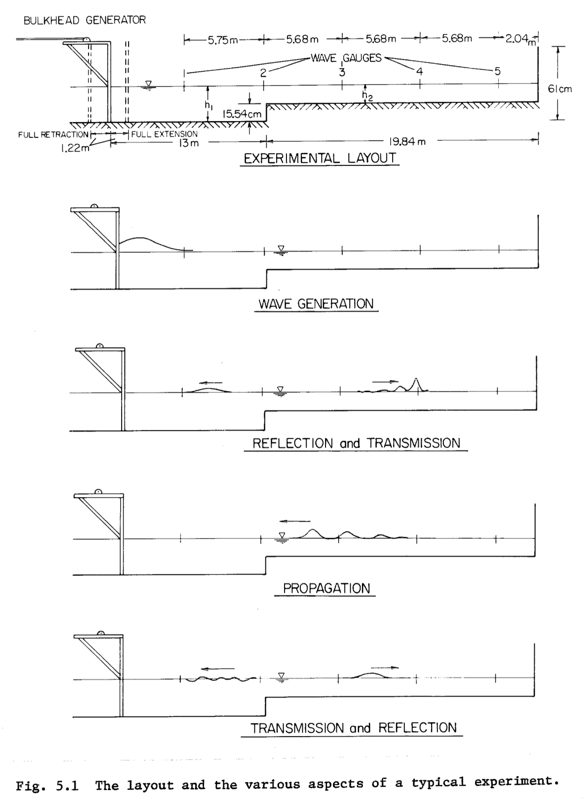
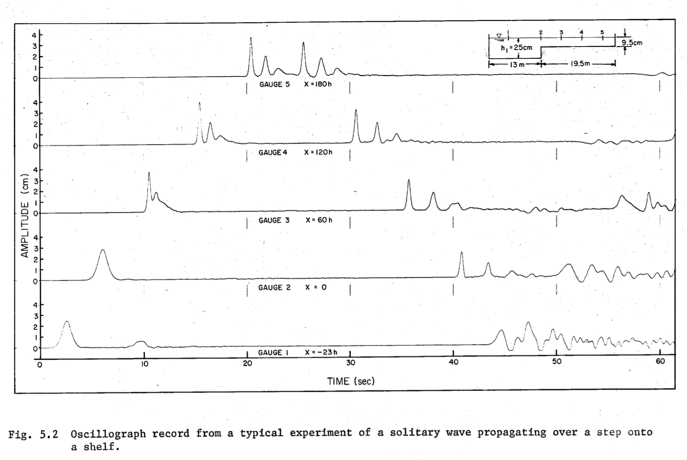

[English](../../examples/goring1979.html)

# 孤立波の生成 (Goring, 1979)

ピストン式造波機を用いた2次元数値造波水槽における孤立波生成の計算例です。
Goring (1979) の手法に基づいています。

## 参考文献

Goring, D.G. (1979). *Tsunamis -- The propagation of long waves onto a shelf*.
W.M. Keck Laboratory of Hydraulics and Water Resources, California Institute of
Technology, Report No. KH-R-38.

## 物理的設定

以下の構成の2次元造波水槽をモデル化します。

- **水深** h = 0.3 m
- **ピストン式造波機** -- 水槽左端に設置
- **消波装置** -- 水槽右端に設置（反射防止）
- **波高計** -- 水槽に沿って複数箇所に配置し、水面変位を記録

造波機の変位は、指定した波高の孤立波を正確に生成するために、孤立波理論から
求められます。

### 孤立波の理論

孤立波の水面変位は以下の式で与えられます。

    eta(x, t) = H * sech^2( sqrt(3H / 4h^3) * (x - c*t) )

ここで、H は波高、h は静水面水深、c = sqrt(g(h + H)) は波速です。
波の下の断面平均水平流速は次の通りです。

    u_bar = c * eta / (h + eta)

造波機の変位は、造波機位置におけるこの流速を時間積分して得られます。





## 入力ファイルの構成

入力ファイル一式は `bem/examples/goring1979/` にあります。全てのパスは
settings.json のあるディレクトリからの相対パスで指定されているため、
修正なしでそのまま実行できます。

### settings.json

シミュレーションパラメータを定義し、他の全ての入力ファイルを参照する
メイン設定ファイルです。

```json
{
    "max_dt": 0.03,
    "end_time_step": 100000,
    "end_time": 20,
    "element": "linear",
    "ALE": "linear",
    "ALEPERIOD": "1",
    "output_directory": "./output",
    "input_files": [
        "tank.json",
        "wavemaker.json",
        "water.json",
        "gauge1.json",
        "gauge2.json",
        "gauge3.json"
    ],
    "meshing_options": [
        "surface_flip"
    ]
}
```

| パラメータ | 説明 |
|-----------|------|
| `max_dt` | 最大時間刻み幅（秒） |
| `end_time_step` | 最大時間ステップ数 |
| `end_time` | シミュレーション終了時刻（秒） |
| `element` | 要素補間タイプ（`linear`, `pseudo_quad`, `true_quadratic`） |
| `ALE` | ALEメッシュ移動スキーム（`linear`, `pseudo_quad`） |
| `ALEPERIOD` | ALEリメッシュ周期 |
| `output_directory` | 出力ディレクトリ（settings.jsonの位置からの相対パス） |
| `input_files` | 構成要素の入力ファイルリスト |

### water.json

表面メッシュファイルを参照して流体領域を定義します。

```json
{
    "name": "water",
    "type": "Fluid",
    "objfile": ["../../../obj/Goring1979/water0d06refined.obj"]
}
```

`objfile` のパスは settings.json のあるディレクトリからの相対パスとして
解決されます。

### tank.json

水槽壁面（底面および側面境界）を剛体として定義します。

```json
{
    "name": "tank",
    "type": "RigidBody",
    "isFixed": true,
    "objfile": ["../../../obj/Goring1979/tank.obj"]
}
```

`isFixed: true` を設定すると、この物体の速度はゼロとなります
（壁面上で phi_n = 0 のノイマン条件）。

### wavemaker.json

孤立波理論に基づく運動パラメータを持つピストン式造波機を定義します。

```json
{
    "name": "wavemaker",
    "type": "RigidBody",
    "velocity": [
        "Goring1979",
        3.0,
        0.025,
        0.25
    ],
    "objfile": ["../../../obj/Goring1979/wavemaker.obj"]
}
```

`velocity` 配列の各要素は以下を指定します。
1. `"Goring1979"` -- 造波手法
2. `3.0` -- 造波機の運動開始時刻（秒）
3. `0.025` -- 波高 H（メートル）
4. `0.25` -- 造波機ストロークに関する追加パラメータ

### gauge*.json

波高計は指定位置における自由表面の変位を記録します。各波高計は鉛直線分
（上端と下端の座標）で定義されます。

```json
{
    "name": "gauge1",
    "type": "wave gauge",
    "position": [-5.75, 0, 0.4, -5.75, 0, 0.2]
}
```

`position` 配列は [x1, y1, z1, x2, y2, z2] を含み、自由表面との交差を
検出する鉛直線分を定義します。

## ビルドと実行

時間領域ソルバをビルドし、計算例を実行します。

```bash
cd bem/build
cmake -DSOURCE_FILE=../main_time_domain.cpp ../..
make -j$(sysctl -n hw.logicalcpu)
./main ../../bem/examples/goring1979/
```

ソルバは指定されたディレクトリから全ての入力ファイルを読み込み、
settings.json で定義された `output_directory` に結果を出力します。

## 期待される結果

- t = 3.0 秒でピストン造波機による孤立波の生成が開始される
- 孤立波が水槽内を伝播し、波高は理論値と良く一致する
- 主波の後方に生じる後続振動は最小限に抑えられる
- 波高計の時系列は解析的な孤立波プロファイルと良好な一致を示す
- 右端の消波装置により反射が低減される

## 関連項目

- [造波理論](../../theory/wave-generation.html)
