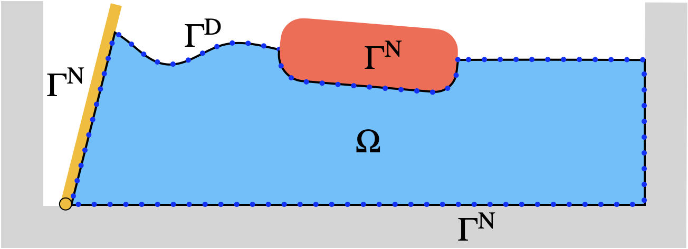

[English version](../../theory/floating-body.html)

# 浮体動力学

本ページでは、BEMソルバーにおける浮体の6自由度剛体運動の取り扱いを解説します。流体力の計算、$\phi_t$ 問題の定式化、加速度の求解手法について述べます。

## 6自由度剛体運動方程式

浮体の並進運動と回転運動は以下の方程式で記述されます。

$$m\,\ddot{\mathbf{x}}_G = \mathbf{F}_{\text{fluid}} + \mathbf{F}_{\text{ext}}$$

$$\mathbf{I}\,\dot{\boldsymbol{\omega}} + \boldsymbol{\omega} \times (\mathbf{I}\,\boldsymbol{\omega}) = \mathbf{T}_{\text{fluid}} + \mathbf{T}_{\text{ext}}$$

ここで $m$ は浮体の質量、$\mathbf{x}_G$ は重心位置、$\mathbf{I}$ は慣性テンソル、$\boldsymbol{\omega}$ は角速度ベクトル、$\mathbf{F}_{\text{ext}}$ と $\mathbf{T}_{\text{ext}}$ は外力（重力、係留力など）です。

### 慣性テンソルの座標変換

慣性テンソル $\mathbf{I}$ は物体固定座標系で定義されますが、運動方程式はグローバル座標系で解く必要があります。回転行列 $\mathbf{R}$ を用いて変換します。

$$\mathbf{I}_{\text{global}} = \mathbf{R}\,\mathbf{I}_{\text{body}}\,\mathbf{R}^T$$

## 圧力積分による流体力

浮体表面 $S_B$ 上の圧力を積分することで流体力とモーメントが得られます。

$$\mathbf{F}_{\text{fluid}} = -\int_{S_B} p\,\mathbf{n}\,dS$$

$$\mathbf{T}_{\text{fluid}} = -\int_{S_B} p\,(\mathbf{x} - \mathbf{x}_G) \times \mathbf{n}\,dS$$

## ベルヌーイ式による圧力計算

非定常ベルヌーイ式から圧力が求まります。

$$p = -\rho\left(\frac{\partial \phi}{\partial t} + \frac{1}{2}|\nabla\phi|^2 + gz\right)$$

ここで $\rho$ は流体密度、$g$ は重力加速度です。右辺の第1項 $\partial\phi/\partial t$（以下 $\phi_t$ と記す）は、ラプラス方程式の解から直接得られないため、追加の境界値問題を解く必要があります。

## $\phi_t$ 問題

$\phi_t$ もラプラス方程式を満たします。

$$\nabla^2 \phi_t = 0 \quad \text{in } \Omega$$

この方程式に対して、$\phi$ の場合と同様にBIEを構成して解きます。

### 自由表面上の境界条件

自由表面上では $\phi_t$ はディリクレ条件として与えられます。力学的自由表面条件から次式が得られます。

$$\phi_t = -gz - \frac{1}{2}|\nabla\phi|^2 \quad \text{on } \Gamma_F$$

### 浮体表面上の境界条件（$\phi_{nt}$）

浮体表面上ではノイマン条件 $\partial\phi_t/\partial n$（すなわち $\phi_{nt}$）を与える必要があります。Wu (1998) に従い、浮体表面上の $\phi_{nt}$ は次のように表されます。

$$\frac{\partial \phi_t}{\partial n} = \ddot{\mathbf{x}}_G \cdot \mathbf{n} + \dot{\boldsymbol{\omega}} \cdot [(\mathbf{x} - \mathbf{x}_G) \times \mathbf{n}] + \boldsymbol{\omega} \cdot [(\mathbf{u}_b - \nabla\phi) \times \mathbf{n}] + q_n$$

ここで $\mathbf{u}_b$ は物体表面の速度、$q_n$ は既知の非線形項です。重要な点は、$\phi_{nt}$ が浮体の加速度 $\ddot{\mathbf{x}}_G$ と角加速度 $\dot{\boldsymbol{\omega}}$ を含んでいることです。これらは未知量であるため、$\phi_t$ 問題と運動方程式を連立して解く必要があります。

## 加速度計算手法

$\phi_t$ と浮体加速度の連立問題を解くために、いくつかの手法が提案されています。

### 間接法

$\phi_t$ を用いず、$\phi$ の時系列データから数値的に $\partial\phi/\partial t$ を差分近似する手法です。実装が容易ですが、時間刻みに依存する精度低下が生じます。

### モード分解法

$\phi_t$ を6つの加速度モード（3並進+3回転）に対応する成分と、加速度に依存しない成分に分解します。

$$\phi_t = \sum_{k=1}^{6} a_k\,\psi_k + \phi_t^{(0)}$$

ここで $a_k$ は各自由度の加速度、$\psi_k$ は単位加速度に対するBIEの解、$\phi_t^{(0)}$ は加速度ゼロの場合の解です。合計7回のBIE求解が必要となります。

### Caoの反復法

加速度の初期推定値を与え、$\phi_t$ 問題の求解と運動方程式の求解を交互に繰り返して収束させる手法です。

1. 加速度を推定
2. $\phi_{nt}$ を計算し、$\phi_t$ のBIEを解く
3. 圧力を積分して流体力を計算
4. 運動方程式から加速度を更新
5. 収束するまで繰り返す

### Maの反復法

Caoの反復法と類似ですが、収束の加速のために緩和係数を導入した手法です。

### 補助関数法（Wu and Taylor 2003）

加速度に依存する部分を補助関数 $\psi_k$ で表し、運動方程式に代入することで加速度を陽的に求める手法です。モード分解法と同様に7回のBIE求解が必要ですが、反復なしに加速度が求まります。

補助関数 $\psi_k$ は次のBIEを満たします。

$$c(\mathbf{x})\,\psi_k(\mathbf{x}) = \int_{\Gamma} \left[ G\,\frac{\partial \psi_k}{\partial n} - \psi_k\,\frac{\partial G}{\partial n} \right] dS$$

浮体表面上の境界条件は：

$$\frac{\partial \psi_k}{\partial n} = n_k \quad (k = 1,2,3), \quad \frac{\partial \psi_k}{\partial n} = [(\mathbf{x} - \mathbf{x}_G) \times \mathbf{n}]_{k-3} \quad (k = 4,5,6)$$

これにより流体力を次のように表現できます。

$$\mathbf{F}_{\text{fluid}} = \mathbf{F}_0 + \mathbf{A}\,\ddot{\mathbf{q}}$$

ここで $\mathbf{A}$ は付加質量行列、$\mathbf{F}_0$ は加速度に依存しない流体力、$\ddot{\mathbf{q}}$ は6自由度の加速度ベクトルです。運動方程式に代入すれば加速度が陽的に求まります。

$$(\mathbf{M} - \mathbf{A})\,\ddot{\mathbf{q}} = \mathbf{F}_0 + \mathbf{F}_{\text{ext}}$$

## 関連ページ

- [理論概要](index.html)
- [境界積分方程式](boundary-integral.html) --- BIEの定式化と離散化
- [造波と波の吸収](wave-generation.html) --- 造波機の境界条件
