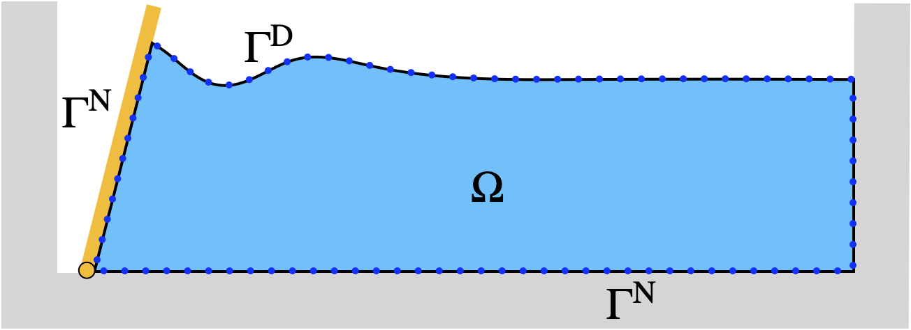
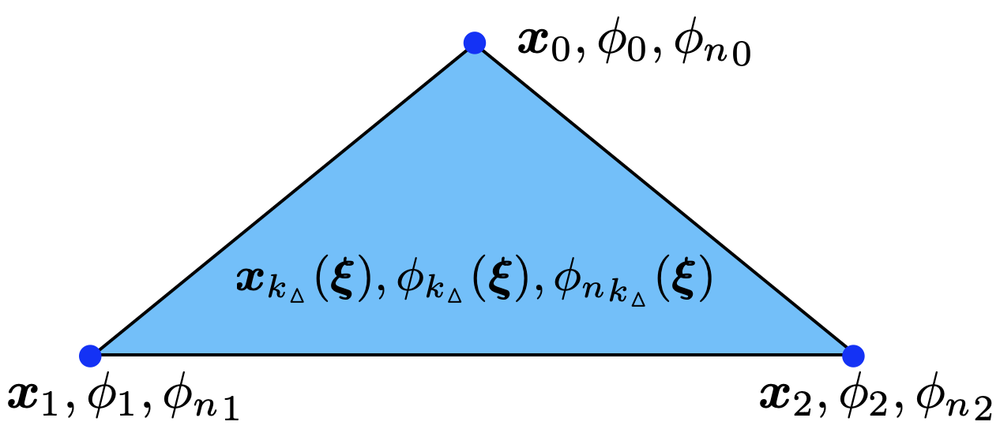

[Japanese version (日本語)](../ja/theory/boundary-integral.html)

# Boundary Integral Equation

This page derives the boundary integral equation (BIE) for potential flow and describes its discretization with linear triangular elements.

## Laplace Equation

For an incompressible, irrotational fluid the velocity potential $\phi(\mathbf{x}, t)$ satisfies the Laplace equation throughout the fluid domain $\Omega$:

$$\nabla^2 \phi = 0 \quad \text{in } \Omega.$$

The fluid velocity is $\mathbf{u} = \nabla\phi$.

## Green's Theorem and the BIE

Applying Green's second identity with the free-space Green's function

$$G(\mathbf{x}, \mathbf{a}) = \frac{-1}{4\pi |\mathbf{x} - \mathbf{a}|}$$

yields the boundary integral equation for a field point $\mathbf{a}$:

$$\alpha(\mathbf{a})\,\phi(\mathbf{a}) = \iint_\Gamma \left[ G(\mathbf{x}, \mathbf{a})\,\phi_n(\mathbf{x}) - \phi(\mathbf{x})\,G_n(\mathbf{x}, \mathbf{a}) \right] dS(\mathbf{x}),$$

where $\phi_n = \partial\phi/\partial n$ is the normal derivative, $G_n = \partial G/\partial n$ is the normal derivative of the Green's function with respect to $\mathbf{x}$, and $\alpha(\mathbf{a})$ is the interior solid angle at $\mathbf{a}$ divided by $4\pi$.

For a smooth boundary $\alpha = 1/2$; at edges and corners the value differs. Computing $\alpha$ directly is inconvenient, so we use the **rigid-mode technique** described below.

## Boundary Types

The boundary $\Gamma$ is partitioned into regions with different conditions:

- **Dirichlet** (D): $\phi$ is known (e.g., the free surface). The unknown is $\phi_n$.
- **Neumann** (N): $\phi_n$ is known (e.g., solid walls, seabed). The unknown is $\phi$.

At edges where a Dirichlet face meets a Neumann face, a single mesh node must carry both types of information. This is handled by the **multi-node** (or **CORNER**) concept: the node stores separate $\phi$ and $\phi_n$ values for each adjacent boundary type, effectively duplicating the degree of freedom.

The solver determines boundary types hierarchically: first each face is assigned a type, then edges inherit from their adjacent faces, and finally point types are resolved from their surrounding edges.

*Figure: Schematic of boundary types on a wave tank cross-section. Dirichlet conditions on the free surface, Neumann conditions on walls and bottom.*

## Discretization with Linear Triangular Elements

The boundary surface is approximated by a mesh of flat triangular elements. Within each triangle the geometry and field variables are interpolated linearly using shape functions.

*Figure: A linear triangular element with parametric coordinates $(\xi_0, \xi_1)$.*

### Shape Functions

For a triangle with vertices $\mathbf{x}_0, \mathbf{x}_1, \mathbf{x}_2$, the parametric coordinates $(\xi_0, \xi_1)$ define the shape functions:

$$N_0(\xi_0, \xi_1) = \xi_0, \qquad N_1(\xi_0, \xi_1) = -\xi_1(\xi_0 - 1), \qquad N_2(\xi_0, \xi_1) = (\xi_0 - 1)(\xi_1 - 1).$$

A point on the element is

$$\mathbf{x}(\xi_0, \xi_1) = \sum_{j=0}^{2} N_j(\xi_0, \xi_1)\,\mathbf{x}_j.$$

The same shape functions interpolate $\phi$ and $\phi_n$ over the element.

### Jacobian for Linear Elements

Because the element is flat, the cross product of the tangent vectors simplifies considerably. The surface element can be written as

$$\frac{\partial \mathbf{x}}{\partial \xi_0} \times \frac{\partial \mathbf{x}}{\partial \xi_1}\,d\xi_0\,d\xi_1 = 2(1 - \xi_0)\,A\,\mathbf{n}\,d\xi_0\,d\xi_1,$$

where $A$ is the triangle area and $\mathbf{n}$ is its outward unit normal. The factor $2(1-\xi_0)$ arises from the parametric mapping and the triangular integration domain $0 \le \xi_0 \le 1$, $0 \le \xi_1 \le 1$.

## Coefficient Matrix Assembly

Substituting the element-wise interpolation into the BIE and collocating at each node $\mathbf{a}_i$ gives the discrete system. The integrals over each element $e$ with nodes $j$ produce two matrices:

$$\alpha_i\,\phi_i + \sum_j N_{ij}\,\phi_j = \sum_j M_{ij}\,\phi_{n,j},$$

where

$$M_{ij} = \sum_e \iint_e G(\mathbf{x}, \mathbf{a}_i)\,N_j(\boldsymbol{\xi})\,dS, \qquad N_{ij} = \sum_e \iint_e G_n(\mathbf{x}, \mathbf{a}_i)\,N_j(\boldsymbol{\xi})\,dS.$$

The summation is over all elements $e$ that contain node $j$. Singular integrals (when $\mathbf{a}_i$ lies on element $e$) require special treatment --- Dunavant quadrature with subtriangle decomposition or the Duffy transformation is used.

### Rigid-Mode Technique

Computing the solid angle $\alpha_i$ at each node is avoided by exploiting the fact that a uniform potential $\phi = 1$ in a closed domain must satisfy the BIE exactly. This gives:

$$\alpha_i + \sum_j N_{ij} = 0 \quad \Rightarrow \quad \alpha_i = -\sum_j N_{ij}.$$

Therefore the diagonal of the effective $N$ matrix (including $\alpha$) is obtained from the row sum of the off-diagonal terms. This is the **rigid-mode technique**, and it eliminates the need for explicit solid angle computation.

## Rearranging into a Linear System

After applying boundary conditions, the known and unknown quantities are separated. All unknowns (whether $\phi$ on Neumann faces or $\phi_n$ on Dirichlet faces) are collected into a single vector $\mathbf{x}$, and the system takes the form

$$A\mathbf{x} = \mathbf{b}.$$

The matrix $A$ is dense but its action on a vector can be evaluated in $O(N)$ time using the [Fast Multipole Method](fmm.html), which makes iterative solution with GMRES practical even for large meshes.

## Multi-Node Treatment at Boundary Transitions

At edges where boundary types change (e.g., where the free surface meets a wall), a single geometric node participates in both Dirichlet and Neumann conditions. The solver duplicates the degree of freedom: one copy carries the Dirichlet value, the other the Neumann value. These **CORNER** nodes ensure that the BIE is well-posed at transitions without introducing spurious constraints.

The boundary type assignment proceeds as:

1. **Faces**: each face is assigned Dirichlet or Neumann based on the physics.
2. **Edges**: an edge shared by two faces of different type becomes a CORNER edge.
3. **Points**: a point adjacent to any CORNER edge becomes a CORNER point.

This hierarchical assignment is automatic and requires no user intervention beyond specifying which surfaces are Dirichlet or Neumann.

---

**See also:** [Floating Body Dynamics](floating-body.html) for additional boundary conditions on moving bodies, and [FMM](fmm.html) for the fast matrix-vector product.
